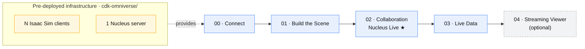

> 🇰🇷 [한국어](README.md) | 🇺🇸 English

# Omniverse Digital Twin Workshop

A workshop where you build a **factory/warehouse digital twin** with NVIDIA Isaac Sim (Omniverse), collaborate with others, and bring it to life with real-time data. Beginner-friendly, in Korean.

---

## 🚶 Start Here — Follow in Order

Work through the documents in the `workshop/` folder **in numerical order**. Each step builds on the previous one.

| Step | Document | What you do | Time |
|:---:|------|------|:---:|
| **00** | [Getting Started](workshop/en/00-getting-started.md) | Multiple users connect to one GPU via DCV sessions + launch Isaac Sim | 10 min |
| **01** | [Building the Scene](workshop/en/01-building-the-scene.md) | Open the warehouse + place robots/equipment + cameras & rendering | 30 min |
| **02** | [Collaboration — Nucleus Live](workshop/en/02-collaboration-nucleus-live.md) ★ | Multiple users edit the same scene simultaneously in real time | 20 min |
| **03** | [Live Data](workshop/en/03-live-data.md) | Simulated robot data → AWS → real-time charts & movement | 40–60 min |
| **04** | [Streaming Viewer](workshop/en/04-streaming-viewer.md) *(optional)* | Multiple users watch/control one GPU from a laptop app | 20–30 min |

> **New here?** → Jump straight to [00. Getting Started](workshop/en/00-getting-started.md).
> No coding or USD syntax knowledge required.

---

## 🗺️ The Big Picture

- **Clients (GPU)**: g6e (L40S). **One machine shared by multiple users** via DCV virtual multi-sessions.
- **Nucleus (collaboration server)**: m7i.xlarge (no GPU needed). Hosts Live co-editing and the self-contained package.
- Actual IPs and passwords change with every deployment, so they are never stored in the repository.

---

## 🛠️ Infrastructure Deployment and Deep-Dive Material

Refer to these when you want to **build and operate** the workshop environment yourself, or dig into how things work internally.
(If you are just following the workshop, you can skip this section.)

### Infrastructure deployment
| Document | Contents |
|------|------|
| **[cdk-omniverse/README.en.md](cdk-omniverse/README.en.md)** | **Automated CDK deployment** (N clients + 1 Nucleus in one shot). Verified with real deployments |
| [docs/en/nucleus-manual-deploy.md](docs/en/nucleus-manual-deploy.md) | **Manual** Nucleus server deployment (EC2 + Docker + NGC). For learning the internals and debugging |

### Deep dives / development notes
| Document | Contents |
|------|------|
| [docs/en/isaac-sim-setup.md](docs/en/isaac-sim-setup.md) | Isaac Sim install & launch, scene-building details, the 100x scale & texture pitfalls, wrapper USD pattern |
| [docs/en/iot-dev-notes.md](docs/en/iot-dev-notes.md) | IoT→Kinesis→Isaac Sim pipeline in detail, `robot.monitor` extension structure & how it works |
| [docs/en/streaming-field-notes.md](docs/en/streaming-field-notes.md) | WebRTC 1:1 limitation, 5.1 config keys, Nucleus Live vs DCV multi-session cost comparison (measured) |

### Code
| Location | Contents |
|------|------|
| `cdk-omniverse/` | Workshop infrastructure IaC (TypeScript CDK) |
| `exts/robot.monitor/` | Isaac Sim real-time monitoring extension |
| `iot/` | Data publishers (`factory_simulator.py`, etc.) + setup scripts + scene |
| `assets/` | Wrapper USD examples (for the small warehouse, reference) |

---

## 🧑‍🏫 Facilitator Guide (Running the Workshop)

The steps a facilitator follows to prepare, verify, and clean up before and after hosting participants.

### 1. Before the workshop — deploy the infrastructure
- Deploy N clients + 1 Nucleus server following [cdk-omniverse/README.en.md](cdk-omniverse/README.en.md).
- Size to headcount: **`clientCount`** = number of GPUs, **`studentCount`** = concurrent users per client.
  Example: 16 people → `clientCount=2 studentCount=8` (8 users share one GPU via DCV virtual sessions).
- After deployment, note the *per-client DCV URLs, Nucleus private IP, and Navigator URL* from the stack **Outputs**.

### 2. Before the workshop — smoke test (required before participants connect)
- [ ] Each client: open `https://<PublicIP>:8443` → can you log in as `ubuntu`?
- [ ] From a student session, run `launch-isaac` → does it start **GPU-accelerated**? (Use `dcvgldiag` to confirm it did not fall back to llvmpipe.)
- [ ] Nucleus: **12 containers Up** + Navigator returns 200 (the `/opt/nucleus/READY` file exists).
- [ ] Multi-session ready: check `systemctl status dcv-multiuser` and confirm the studentN sessions with `sudo dcv list-sessions`.

### 3. What to hand out to participants
| Item | Value |
|------|-----|
| Connection URL | `https://<PublicIP>:8443` of their assigned client |
| Account | `student1`..`studentN` — **one per person** (no sharing the same account) |
| Password | The `StudentPassword` set at deployment (if left blank, see `/opt/dcv-multiuser/CREDENTIALS.txt` on the client) |
| Nucleus connection address | The **Nucleus private IP** from the Outputs (used in Isaac Sim / Navigator) |
| First document | [workshop/en/00-getting-started.md](workshop/en/00-getting-started.md) |

### 4. During the workshop — rules to announce up front
- Launch Isaac Sim with **`launch-isaac`**, not `isaac-sim.sh` (per-uid port separation, avoids port conflicts).
- **Never log out of the OS inside a session** — it breaks the virtual session and blocks reconnection. (Recovery: the facilitator closes and re-creates the session.)
- Open Navigator with **epiphany**, not snap firefox (`epiphany http://<NucleusPrivateIP>:8080`).

### 5. Afterwards — cleanup (cost/security)
- **Delete the infrastructure** to stop GPU billing → see the [deletion procedure in cdk-omniverse/README.en.md](cdk-omniverse/README.en.md).
  After deletion, always verify the instances are actually `terminated`.
- Clean up credentials: revoke (rotate) the NGC API key, change the Nucleus password.
- Never commit real IPs, keys, or passwords to the repository (`.gitignore` blocks `*.pem`, `CREDENTIALS.txt`, etc.).
