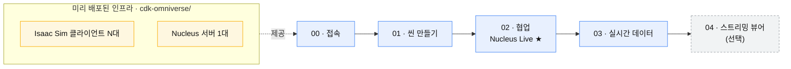

# Omniverse 디지털 트윈 워크숍

NVIDIA Isaac Sim(Omniverse)으로 **공장/창고 디지털 트윈**을 만들고, 여러 명이 협업하며,
실시간 데이터로 살아 움직이게 하는 워크숍입니다. 입문자 대상, 한국어.

---

## 🚶 여기부터 — 순서대로 따라가세요

`workshop/` 폴더의 문서를 **번호 순서대로** 진행합니다. 각 단계는 앞 단계를 전제로 합니다.

| 단계 | 문서 | 무엇을 하나 | 소요 |
|:---:|------|------|:---:|
| **00** | [시작하기](workshop/00-시작하기.md) | GPU 1대에 여러 명이 DCV 세션으로 접속 + Isaac Sim 실행 | 10분 |
| **01** | [씬 만들기](workshop/01-씬-만들기.md) | 창고 열기 + 로봇·설비 배치 + 카메라·렌더링 | 30분 |
| **02** | [협업 — Nucleus Live](workshop/02-협업-Nucleus-Live.md) ★ | 여러 명이 같은 씬을 실시간 동시편집 | 20분 |
| **03** | [실시간 데이터](workshop/03-실시간-데이터.md) | 가짜 로봇 데이터 → AWS → 실시간 차트·이동 | 40~60분 |
| **04** | [스트리밍 뷰어](workshop/04-스트리밍-뷰어.md) *(선택)* | GPU 1대를 여러 명이 노트북 앱으로 관전·조작 | 20~30분 |

> **처음이라면** → [00. 시작하기](workshop/00-시작하기.md) 로 바로 이동하세요.
> 코딩·USD 문법 지식은 필요 없습니다.

---

## 🗺️ 전체 그림

- **클라이언트(GPU)**: g6e (L40S). DCV virtual 다중세션으로 **1대를 여러 명이** 공유.
- **Nucleus(협업 서버)**: m7i.xlarge (GPU 불필요). Live 동시편집·자급자족 패키지 호스팅.
- 실제 IP·비밀번호는 배포 때마다 다르므로 저장소에 두지 않습니다.

---

## 🛠️ 인프라 배포와 심화 자료

워크숍 환경을 **직접 구축·운영**하거나 내부 동작을 더 파고들 때 참고하세요.
(워크숍만 따라간다면 볼 필요는 없습니다.)

### 인프라 배포
| 문서 | 내용 |
|------|------|
| **[cdk-omniverse/README.md](cdk-omniverse/README.md)** | **CDK 자동 배포** (클라이언트 N대 + Nucleus 1대 한 번에). 실배포 검증 완료 |
| [docs/nucleus-수동배포.md](docs/nucleus-수동배포.md) | Nucleus 서버 **수동** 배포 (EC2 + Docker + NGC). 원리 학습·디버깅용 |

### 심화 / 개발 노트
| 문서 | 내용 |
|------|------|
| [docs/isaac-sim-셋업.md](docs/isaac-sim-셋업.md) | Isaac Sim 설치·실행, 씬 구축 상세, 100배 스케일·텍스처 함정, 래퍼 USD 패턴 |
| [docs/iot-개발노트.md](docs/iot-개발노트.md) | IoT→Kinesis→Isaac Sim 파이프라인 상세, `robot.monitor` 확장 구조·동작 원리 |
| [docs/스트리밍-실측노트.md](docs/스트리밍-실측노트.md) | WebRTC 1:1 한계, 5.1 설정 키, Nucleus Live vs DCV 다중세션 비용 비교 (실측) |

### 코드
| 위치 | 내용 |
|------|------|
| `cdk-omniverse/` | 워크숍 인프라 IaC (TypeScript CDK) |
| `exts/robot.monitor/` | Isaac Sim 실시간 모니터링 확장 |
| `iot/` | 데이터 발행기(`factory_simulator.py` 등) + 셋업 스크립트 + 씬 |
| `assets/` | 래퍼 USD 예시 (소형 창고용, 참고) |

---

## 🧑‍🏫 진행자 가이드 (워크숍 운영)

참가자를 받기 전, 진행자가 준비·확인·정리하는 순서입니다.

### 1. 시작 전 — 인프라 배포
- [cdk-omniverse/README.md](cdk-omniverse/README.md) 로 클라이언트 N대 + Nucleus 1대 배포.
- 인원에 맞춰 규모 조정: **`clientCount`** = GPU 대수, **`studentCount`** = 클라이언트 1대당 동시 접속 인원.
  예) 16명 → `clientCount=2 studentCount=8` (GPU 1대를 8명이 DCV virtual 세션으로 공유).
- 배포 완료 후 스택 **Outputs** 에서 *클라이언트별 DCV URL · Nucleus 사설IP · Navigator URL* 을 받아 둡니다.

### 2. 시작 전 — 동작 확인 (참가자 접속 전 필수)
- [ ] 각 클라이언트 `https://<PublicIP>:8443` 접속 → `ubuntu` 로 로그인 되는지.
- [ ] student 세션에서 `launch-isaac` 실행 → **GPU 가속**으로 뜨는지 (`dcvgldiag` 로 llvmpipe 폴백 아님 확인).
- [ ] Nucleus 컨테이너 **12개 Up** + Navigator 200 응답 (`/opt/nucleus/READY` 파일 존재).
- [ ] 다중세션 준비 완료: `systemctl status dcv-multiuser`, `sudo dcv list-sessions` 로 studentN 세션 확인.

### 3. 참가자에게 나눠줄 것
| 항목 | 값 |
|------|-----|
| 접속 주소 | 배정한 클라이언트의 `https://<PublicIP>:8443` |
| 계정 | `student1`..`studentN` — **한 사람당 하나씩 배정** (같은 계정 중복 접속 금지) |
| 비밀번호 | 배포 시 정한 `StudentPassword` (비웠다면 클라이언트 `/opt/dcv-multiuser/CREDENTIALS.txt`) |
| Nucleus 연결 주소 | 출력의 **Nucleus 사설IP** (Isaac Sim / Navigator 에서 사용) |
| 첫 문서 | [workshop/00-시작하기.md](workshop/00-시작하기.md) |

### 4. 진행 중 — 참가자에게 미리 공지할 규칙
- Isaac Sim 은 `isaac-sim.sh` 대신 **`launch-isaac`** 으로 실행 (uid별 포트 자동 분리, 포트 충돌 방지).
- **세션 안에서 OS 로그아웃 금지** — virtual 세션이 깨져 재접속 불가. (복구는 진행자가 세션 close→create)
- Navigator 는 snap firefox 대신 **epiphany** 로 (`epiphany http://<Nucleus사설IP>:8080`).

### 5. 끝난 후 — 정리 (비용/보안)
- **인프라 삭제**로 GPU 과금 중단 → [cdk-omniverse/README.md 삭제 절차](cdk-omniverse/README.md) 참고.
  삭제 후 인스턴스가 실제 `terminated` 인지 반드시 확인.
- 자격증명 정리: NGC API 키 폐기(rotate), Nucleus 비밀번호 교체.
- 저장소에 실제 IP·키·비밀번호를 커밋하지 말 것 (`.gitignore` 가 `*.pem`·`CREDENTIALS.txt` 등 차단).
