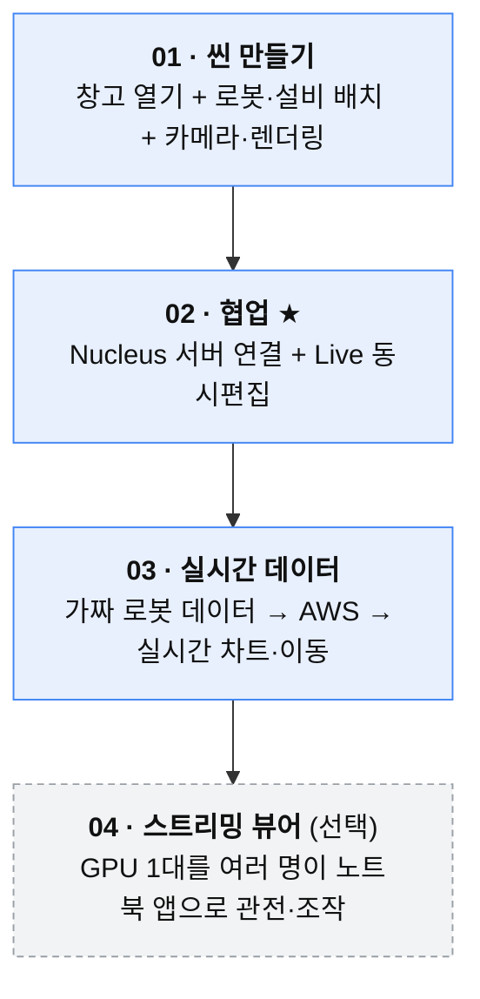
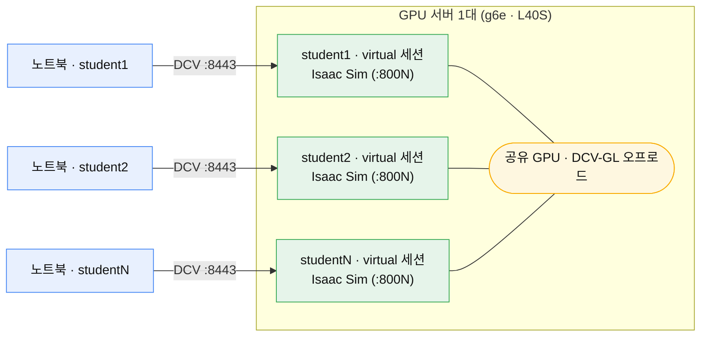

# 00. 시작하기 — 접속과 전체 흐름

> 이 워크숍의 **출발점**입니다. 원격 데스크톱에 접속해 Isaac Sim 화면을 띄우는 것까지 안내합니다.
> 코딩·USD 문법 지식은 필요 없습니다. 마우스와 복사·붙여넣기만으로 진행합니다.

---

## 이 워크숍에서 만드는 것

대형 창고를 열고 → 로봇·설비를 배치하고 → 여러 명이 실시간으로 함께 편집하고 →
가짜 운영 데이터로 로봇을 살아 움직이게 만드는 **디지털 트윈**입니다.



각 단계는 앞 단계를 전제로 하니 **번호 순서대로** 진행하세요.

---

## STEP 1. 원격 데스크톱(DCV) 접속

미리 안내받은 **접속 주소·계정·비밀번호**로 접속합니다.

| 항목 | 값 |
|------|-----|
| 주소 | `https://<접속 IP>:8443` |
| 계정 | `studentN` (예: `student1` … `student8` — 각자 배정받은 번호) |
| 비밀번호 | (안내받은 값) |

- 브라우저에서 위 주소로 접속하거나, **NICE DCV 클라이언트**(권장, 더 부드러움)를 설치해 접속합니다.
- 인증서 경고가 뜨면 "계속 진행"으로 넘어갑니다(워크숍용 self-signed).
- **각자 배정받은 `studentN` 계정으로만** 접속하세요. 남의 번호로 들어가면 세션이 충돌합니다.

### 여러 명이 GPU 1대를 나눠 쓰는 구조

이 워크숍은 **GPU 1대(예: L40S)에 여러 명이 각자의 DCV 세션으로 동시 접속**해
Omniverse(Isaac Sim)를 GPU 가속으로 돌립니다. 사람마다 서버를 띄우지 않아 **비용을 크게 줄입니다.**



- 각자 **자기 `studentN` 데스크톱(virtual 세션)**을 독립적으로 가집니다. 다른 사람 화면과 섞이지 않습니다.
- 세 GPU 세션이 **하나의 GPU를 공유**합니다(DCV-GL이 3D 렌더를 GPU로 오프로드). L40S 48GB 기준 8명 검증됨.
- 이 상태에서 [02. 협업](02-협업-Nucleus-Live.md)의 Nucleus Live를 켜면, 나눠 쓰면서도 **같은 씬**을 함께 볼 수 있습니다.

> 💡 이 구조가 어떻게 자동 구성되는지(virtual 세션·GPU Xorg 정렬·계정 분리)와 직접 배포 방법은
> [`../docs/스트리밍-실측노트.md`](../docs/스트리밍-실측노트.md)와 [`../cdk-omniverse/README.md`](../cdk-omniverse/README.md) 참고.

---

## STEP 2. Isaac Sim 실행

DCV 데스크톱의 터미널을 열고:

```bash
launch-isaac
```

- `launch-isaac` 은 계정별로 포트를 자동 분리해 **여러 명이 동시에 띄워도 충돌하지 않게** 해줍니다.
  (`isaac-sim.sh` 를 직접 부르면 `address already in use` 로 죽을 수 있습니다.)
- **첫 실행은 셰이더 컴파일로 4~8분** 걸립니다. 검은 창이어도 정상입니다.
  우측 하단 진행바가 100%가 되면 화면이 뜹니다. (여러 명이 동시에 처음 열면 더 느릴 수 있습니다.)

특정 워크숍 씬·확장을 함께 켜야 하면 인자를 그대로 넘길 수 있습니다:
```bash
launch-isaac --ext-folder ~/digital_twin/exts --enable robot.monitor
```

> 단독 서버·직접 설치 환경이라면 `launch-isaac` 대신 `/opt/IsaacSim/isaac-sim.sh` 를
> 쓰는 상세 절차는 [`../docs/isaac-sim-셋업.md`](../docs/isaac-sim-셋업.md) 참고.

---

## 공통 문제 (막히면 여기부터)

| 증상 | 해결 |
|------|------|
| **한글이 `ㅇㅏㄴ`처럼 분리 입력** | 로컬 PC 입력기를 **영문(ABC)** 으로 고정. Isaac Sim 입력란은 영문 상태에서 입력 |
| **숫자·경로 입력이 안 됨** | ① 입력기 영문 확인, ② 속성 옆 **자물쇠 unlock** |
| **화면이 계속 회색/검정** | 텍스처·셰이더 로딩 중. 30초~1분 대기 |
| **로그아웃 금지** | 세션 안에서 OS 로그아웃하면 재접속이 막힙니다. 창만 닫고 두세요 |

준비가 됐으면 → **[01. 씬 만들기](01-씬-만들기.md)** 로 이동하세요.
