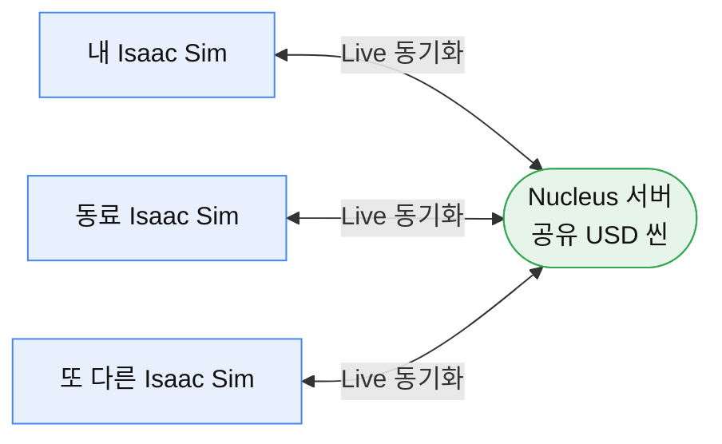

# 02. 협업 — Nucleus 연결 + Live 동시편집 ★

> **← 이전:** [01. 씬 만들기](01-씬-만들기.md) &nbsp;|&nbsp; **다음 →** [03. 실시간 데이터](03-실시간-데이터.md)
>
> 여러 명이 **같은 씬을 실시간으로 함께 편집**하는 워크숍의 하이라이트입니다.
> Nucleus 협업 서버가 미리 떠 있어야 합니다(배포는 [`../docs/`](../docs/) 참고).

**전제:** [01. 씬 만들기](01-씬-만들기.md)를 해봐서 Isaac Sim 조작에 익숙한 상태.

---

## 무엇을 하나

Nucleus는 여러 Isaac Sim이 **하나의 USD 씬을 공유**하게 해주는 협업 서버입니다.
Live 모드를 켜면 한 사람의 편집이 다른 모두의 화면에 **즉시** 반영됩니다.



---

## STEP 1. Nucleus 서버 연결

1. Isaac Sim **Content** 패널 → **Add New Connection** (또는 `+`)
2. 서버 주소 입력: 안내받은 **Nucleus 사설 IP** (예: `<Nucleus-사설IP>`)
3. 로그인: `omniverse` / (안내받은 비밀번호)
4. 연결되면 Content 패널에 서버가 나타난다.

> 💡 Nucleus 주소는 보통 **사설 IP**입니다(같은 네트워크 안이라 공인 IP가 아님).
> Navigator 웹 UI가 필요하면 데스크톱 브라우저에서 `epiphany http://<Nucleus-IP>:8080`.

---

## STEP 2. 공유 씬 열기

Content에서 안내받은 경로로 이동해 메인 USD를 엽니다. 예:
```
omniverse://<Nucleus-IP>/Projects/factory_workshop_collected_v2/<메인USD>
```
- 이 패키지는 **자급자족(self-contained)** — 인터넷 없이도 모든 에셋·텍스처가 열린다.
  (S3 원본을 Nucleus로 미리 Collect 해둔 것. 원리는 [`../docs/nucleus-수동배포.md`](../docs/nucleus-수동배포.md) Collect 절.)

---

## STEP 3. Live 모드 켜기 ⚡

- 상단 툴바의 **번개(⚡) 아이콘** 또는 **"Live"** 토글 클릭 → Live 세션 진입.
- **모두가 같은 씬에서 Live를 켜야** 편집이 실시간 동기화된다.

---

## STEP 4. 동시편집 확인

- 한 사람이 로봇/설비를 `W`(이동)로 옮기면 → **다른 사람 화면에서도 즉시 움직인다.** 🎉
- 여러 명이 각자 다른 설비를 동시에 배치하며 하나의 디지털 트윈을 함께 완성.

> 검증됨: Isaac Sim 2대에서 같은 패키지를 Live로 열어 동시편집 동작 확인.

---

## 자주 막히는 곳

| 증상 | 해결 |
|------|------|
| 서버 연결이 안 됨 | 주소가 **사설 IP**인지 확인. 안내받은 정확한 주소·계정·비밀번호인지 |
| 씬은 열리는데 회색 | 자급자족 패키지가 아니거나 로딩 중. 30초~1분 대기 |
| 내 편집이 남에게 안 보임 | **모두가** Live(⚡)를 켰는지 확인. 한 명이라도 안 켜면 그 사람은 반영 안 됨 |
| Navigator 웹이 안 열림 | 데스크톱 브라우저(`epiphany`)로 사설 IP:8080 접속. 외부 브라우저는 차단됨 |

> 협업 서버를 **직접 배포**하려면 [`../docs/nucleus-수동배포.md`](../docs/nucleus-수동배포.md)
> (수동) 또는 [`../cdk-omniverse/README.md`](../cdk-omniverse/README.md) (CDK 자동 배포)를 참고하세요.

---

**다음 →** [03. 실시간 데이터 — 살아 움직이는 트윈](03-실시간-데이터.md)
