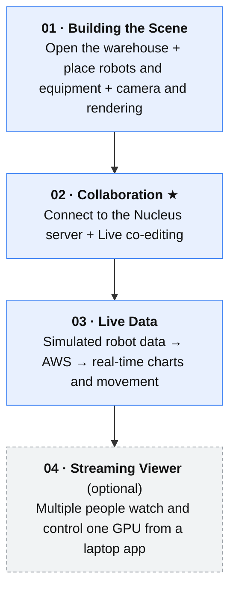
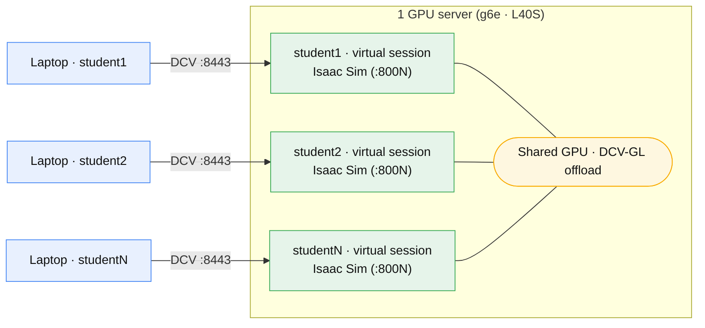

> 🇰🇷 [한국어](../00-시작하기.md) | 🇺🇸 English

# 00. Getting Started — Connecting and the Big Picture

> This is the **starting point** of the workshop. It walks you through connecting to the remote desktop and getting the Isaac Sim window on screen.
> No coding or USD knowledge required — everything is done with the mouse and copy-paste.

---

## What You Will Build in This Workshop

Open a large warehouse → place robots and equipment → edit it together with others in real time →
bring the robots to life with simulated operational data — a **digital twin**.



Each step builds on the previous one, so work through them **in numerical order**.

---

## STEP 1. Connect to the Remote Desktop (DCV)

Connect using the **address, account, and password** you were given.

| Item | Value |
|------|-----|
| Address | `https://<access IP>:8443` |
| Account | `studentN` (e.g. `student1` … `student8` — the number assigned to you) |
| Password | (as provided) |

- Connect via a browser at the address above, or install the **NICE DCV client** (recommended — smoother experience).
- If you see a certificate warning, choose "Continue" (workshop-only self-signed certificate).
- **Only log in with your assigned `studentN` account.** Using someone else's number will cause session conflicts.

### How Multiple People Share One GPU

In this workshop, **multiple participants connect simultaneously to a single GPU (e.g. an L40S), each with their own DCV session**,
running Omniverse (Isaac Sim) with GPU acceleration. Since we don't spin up a server per person, this **cuts costs dramatically.**



- Everyone gets their **own independent `studentN` desktop (virtual session)**. Your screen never mixes with anyone else's.
- All the GPU sessions **share a single GPU** (DCV-GL offloads 3D rendering to the GPU). Verified with 8 users on an L40S with 48 GB.
- With this in place, turning on Nucleus Live in [02. Collaboration](02-collaboration-nucleus-live.md) lets everyone view **the same scene** together while sharing the GPU.

> 💡 For how this setup is provisioned automatically (virtual sessions, GPU Xorg alignment, account separation) and how to deploy it yourself, see
> [`../../docs/en/streaming-field-notes.md`](../../docs/en/streaming-field-notes.md) and [`../../cdk-omniverse/README.en.md`](../../cdk-omniverse/README.en.md).

---

## STEP 2. Launch Isaac Sim

Open a terminal on the DCV desktop and run:

```bash
launch-isaac
```

- `launch-isaac` automatically assigns a separate port per account so **multiple people can launch at the same time without conflicts**.
  (Calling `isaac-sim.sh` directly may crash with `address already in use`.)
- **The first launch takes 4–8 minutes for shader compilation.** A black window is normal.
  The UI appears once the progress bar in the bottom right reaches 100%. (It can be slower if several people launch for the first time simultaneously.)

If you need to launch with a specific workshop scene or extension, pass the arguments straight through:
```bash
launch-isaac --ext-folder ~/digital_twin/exts --enable robot.monitor
```

> On a standalone server or a manual install, use `/opt/IsaacSim/isaac-sim.sh` instead of `launch-isaac` —
> see [`../../docs/en/isaac-sim-setup.md`](../../docs/en/isaac-sim-setup.md) for the detailed procedure.

---

## Common Issues (Start Here If You Get Stuck)

| Symptom | Fix |
|------|------|
| **Korean characters come out decomposed, like `ㅇㅏㄴ`** | Lock your local PC's input method to **English (ABC)**. Type into Isaac Sim fields while in English mode |
| **Can't type numbers or paths** | ① Confirm the input method is English, ② **unlock the padlock** next to the property |
| **Screen stays gray/black** | Textures/shaders are still loading. Wait 30 seconds to 1 minute |
| **Never log out** | Logging out of the OS inside the session blocks reconnection. Just close the window and leave it |

Ready? Move on to **[01. Building the Scene](01-building-the-scene.md)**.
