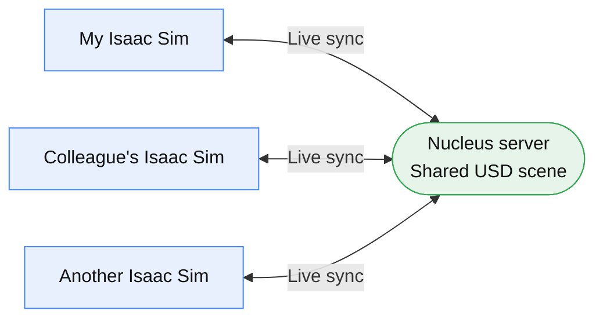

> 🇰🇷 [한국어](../02-협업-Nucleus-Live.md) | 🇺🇸 English

# 02. Collaboration — Nucleus Connection + Live Co-editing ★

> **← Previous:** [01. Building the Scene](01-building-the-scene.md) &nbsp;|&nbsp; **Next →** [03. Live Data](03-live-data.md)
>
> This is the highlight of the workshop: multiple people **editing the same scene together in real time**.
> A Nucleus collaboration server must already be running (see [`../../docs/`](../../docs/) for deployment).

**Prerequisite:** You have gone through [01. Building the Scene](01-building-the-scene.md) and are comfortable operating Isaac Sim.

---

## What This Step Does

Nucleus is a collaboration server that lets multiple Isaac Sim instances **share a single USD scene**.
With Live mode on, one person's edits appear **instantly** on everyone else's screen.



---

## STEP 1. Connect to the Nucleus Server

1. Isaac Sim **Content** panel → **Add New Connection** (or `+`)
2. Enter the server address: the **Nucleus private IP** you were given (e.g. `<Nucleus-private-IP>`)
3. Log in: `omniverse` / (the password you were given)
4. Once connected, the server appears in the Content panel.

> 💡 The Nucleus address is usually a **private IP** (same network, so no public IP).
> If you need the Navigator web UI, open `epiphany http://<Nucleus-IP>:8080` in the desktop browser.

---

## STEP 2. Open the Shared Scene

In Content, navigate to the path you were given and open the main USD. Example:
```
omniverse://<Nucleus-IP>/Projects/factory_workshop_collected_v2/<main-USD>
```
- This package is **self-contained** — all assets and textures open without internet access.
  (The S3 originals were pre-Collected into Nucleus. See the Collect section of [`../../docs/en/nucleus-manual-deploy.md`](../../docs/en/nucleus-manual-deploy.md) for how it works.)

---

## STEP 3. Turn On Live Mode ⚡

- Click the **lightning bolt (⚡) icon** or the **"Live"** toggle in the top toolbar → you join the Live session.
- **Everyone must turn on Live in the same scene** for edits to sync in real time.

---

## STEP 4. Verify Co-editing

- When one person moves a robot or piece of equipment with `W` (translate) → **it moves instantly on everyone else's screen.** 🎉
- Several people can place different equipment at the same time, completing one digital twin together.

> Verified: two Isaac Sim instances opened the same package in Live mode and co-editing worked.

---

## Common Sticking Points

| Symptom | Fix |
|------|------|
| Can't connect to the server | Confirm the address is the **private IP**, and that you're using the exact address, account, and password you were given |
| Scene opens but is gray | Either not the self-contained package, or still loading. Wait 30 seconds to 1 minute |
| My edits don't show for others | Confirm **everyone** turned on Live (⚡). Anyone who hasn't won't receive updates |
| Navigator web UI won't open | Use the desktop browser (`epiphany`) to reach the private IP on port 8080. External browsers are blocked |

> To **deploy the collaboration server yourself**, see [`../../docs/en/nucleus-manual-deploy.md`](../../docs/en/nucleus-manual-deploy.md)
> (manual) or [`../../cdk-omniverse/README.en.md`](../../cdk-omniverse/README.en.md) (automated CDK deployment).

---

**Next →** [03. Live Data — A Twin That Comes Alive](03-live-data.md)
