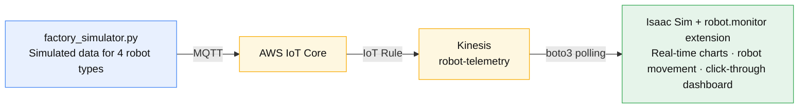

> 🇰🇷 [한국어](../03-실시간-데이터.md) | 🇺🇸 English

# 03. Live Data — A Twin That Comes Alive

> **← Previous:** [02. Collaboration](02-collaboration-nucleus-live.md) &nbsp;|&nbsp; **Next →** [04. Streaming Viewer](04-streaming-viewer.md)
>
> **Goal**: Place four robot types in a large warehouse and build a digital twin where simulated
> operational data flows through AWS and comes alive inside Isaac Sim as **real-time charts + robot movement**.
> **Audience**: Beginners. Just copy and paste the commands as-is.
> **Time**: About 40–60 minutes (including Isaac Sim's first startup).



Prerequisites: an AWS account/credentials, NVIDIA Isaac Sim 5.1 installed, internet access.
The examples use the `ap-northeast-2` (Seoul) region.

---

## STEP 0. Check Your Setup

```bash
aws sts get-caller-identity          # AWS credentials OK?
ls /opt/IsaacSim/isaac-sim.sh        # Isaac Sim installed OK?
python3 -c "import boto3, awsiot"    # Libraries OK? (if not, see below)
```
If the libraries are missing:
```bash
sudo apt-get install -y python3-pip
python3 -m pip install --break-system-packages awsiotsdk boto3
```

---

## STEP 1. Create the AWS IoT Infrastructure (one-time)

> If it's already set up, skip to STEP 2. If this is your first time, go through the steps in order.

### 1-1. Kinesis stream
```bash
RG=ap-northeast-2
aws kinesis create-stream --region $RG --stream-name robot-telemetry --shard-count 1
aws kinesis wait stream-exists --region $RG --stream-name robot-telemetry
```

### 1-2. IoT→Kinesis permissions (IAM role)
```bash
ACCT=$(aws sts get-caller-identity --query Account --output text)
cat > /tmp/iot-trust.json <<'EOF'
{"Version":"2012-10-17","Statement":[{"Effect":"Allow","Principal":{"Service":"iot.amazonaws.com"},"Action":"sts:AssumeRole"}]}
EOF
aws iam create-role --role-name iot-to-kinesis-role --assume-role-policy-document file:///tmp/iot-trust.json
cat > /tmp/kinesis-put.json <<EOF
{"Version":"2012-10-17","Statement":[{"Effect":"Allow","Action":"kinesis:PutRecord","Resource":"arn:aws:kinesis:$RG:$ACCT:stream/robot-telemetry"}]}
EOF
aws iam put-role-policy --role-name iot-to-kinesis-role --policy-name kinesis-put --policy-document file:///tmp/kinesis-put.json
```

### 1-3. IoT device (Thing) + certificate
```bash
mkdir -p ~/digital_twin/iot/certs && cd ~/digital_twin/iot/certs
aws iot create-thing --region $RG --thing-name factory_robots
CERT_ARN=$(aws iot create-keys-and-certificate --region $RG --set-as-active \
  --certificate-pem-outfile device.cert.pem \
  --public-key-outfile device.public.key \
  --private-key-outfile device.private.key \
  --query certificateArn --output text)
curl -s https://www.amazontrust.com/repository/AmazonRootCA1.pem -o AmazonRootCA1.pem
cat > /tmp/iot-policy.json <<'EOF'
{"Version":"2012-10-17","Statement":[{"Effect":"Allow","Action":["iot:Connect","iot:Publish","iot:Subscribe","iot:Receive"],"Resource":"*"}]}
EOF
aws iot create-policy --region $RG --policy-name robot-telemetry-policy --policy-document file:///tmp/iot-policy.json
aws iot attach-policy --region $RG --policy-name robot-telemetry-policy --target "$CERT_ARN"
aws iot attach-thing-principal --region $RG --thing-name factory_robots --principal "$CERT_ARN"
```
> ⚠️ The private key in `certs/` is a secret. Never commit it to git or anywhere else.

### 1-4. IoT rule: MQTT → Kinesis
```bash
ROLE_ARN=$(aws iam get-role --role-name iot-to-kinesis-role --query Role.Arn --output text)
cat > /tmp/iot-rule.json <<EOF
{"sql":"SELECT * FROM 'robots/+/telemetry'","awsIotSqlVersion":"2016-03-23","ruleDisabled":false,
 "actions":[{"kinesis":{"streamName":"robot-telemetry","roleArn":"$ROLE_ARN","partitionKey":"\${topic(2)}"}}]}
EOF
aws iot create-topic-rule --region $RG --rule-name robot_telemetry_to_kinesis --topic-rule-payload file:///tmp/iot-rule.json
```

---

## STEP 2. Run the Simulated Data Generator (4 robot types)

The publisher needs a venv + awsiotsdk + the certificates in `iot/certs/`. Set up once, then run:
```bash
cd ~/digital_twin/iot          # (on workshop clients: ~/nvidia-omniverse-digital-twin/iot)
bash setup_publisher.sh        # venv + awsiotsdk + IOT_ENDPOINT cache (idempotent, first time only)
IOT_ENDPOINT=$(cat ~/.iot_endpoint) ~/venv/bin/python -u factory_simulator.py --interval 3
```
> You must use `~/venv/bin/python` (the system python doesn't have awsiotsdk). For details, see chapter 2 of [`../../docs/en/iot-dev-notes.md`](../../docs/en/iot-dev-notes.md).
> `factory_simulator.py` publishes all four robot types. `robot_simulator.py` publishes only nova_carter, so it's not suitable for the demo.

Four robots send data:
| Robot | Type | Key metrics |
|------|------|-----------|
| nova_carter_01 | AMR | battery, speed, motor_temp, movement |
| iw_hub_01 | AMR | battery, speed, motor_temp, movement |
| franka_01 | Robot arm | joint_angle, cycle_count, payload, gripper |
| digit_01 | Humanoid | gait_speed, balance, battery, gait |

You've succeeded if you see 4 lines like `[nova_carter_01] type=amr ...` every 5 seconds.
**Leave this terminal running** and continue to the next step. (Stop with Ctrl+C.)

Optional check — data reaching Kinesis:
```bash
SHARD=$(aws kinesis get-shard-iterator --region ap-northeast-2 --stream-name robot-telemetry \
  --shard-id shardId-000000000000 --shard-iterator-type LATEST --query ShardIterator --output text)
sleep 8; aws kinesis get-records --region ap-northeast-2 --shard-iterator "$SHARD" --limit 10
```

---

## STEP 3. Launch Isaac Sim + Open the Factory Scene

In a new terminal, launch with the **monitoring extension** enabled (assuming the multi-user environment — ports are separated automatically):
```bash
launch-isaac --ext-folder ~/digital_twin/exts --enable robot.monitor
```

> For why we use `launch-isaac` and how to run directly (`/opt/IsaacSim/isaac-sim.sh`), see
> [00. Getting Started](00-getting-started.md) STEP 2. Here we add `--ext-folder ... --enable robot.monitor`
> to also enable the real-time monitoring extension (`robot.monitor`).

- The first startup takes 4–8 minutes for shader compilation. A black window is normal. The UI appears once the progress bar in the bottom right reaches 100%.
  (If several people launch for the first time simultaneously, shader compilation contention can make it slower.)
- Once the extension is enabled, it automatically opens the PoC scene if the stage is empty.
  To use the four-robot factory scene, in Isaac Sim go to **File → Open**:
  ```
  /home/ubuntu/digital_twin/iot/factory_scene.usda
  ```
  (Loads the large warehouse + 4 robot types. First load takes 1–3 minutes.)

> ⚠️ In the DCV environment, if the Korean input method blocks path entry, switch the keyboard to English before typing.

---

## STEP 4. Verify Real-Time Monitoring

In the **"Robot Telemetry Monitor"** window on screen:
- **Publish** checkbox ON (default): reads Kinesis data and writes it to the robots' USD.
- **Move** checkbox ON (default): smoothly moves robots to the positions in the data.
- Pick a robot in the **Robot** combo box → its metrics and charts are displayed.
- **Charts**: real-time lines for battery / motor_temp / speed.

Things to check:
1. In the viewport, **the AMRs and the humanoid roam the warehouse**, and the robot arm moves in place.
2. Charts refresh every 5 seconds.
3. **Click a robot in the viewport** → the combo box switches to that robot and the dashboard follows.
4. When an AMR's battery drops below 20% → status=charging, and the battery curve rebounds.

---

## STEP 5. (Optional) Collaboration — Everyone Sees the Same Twin

To have multiple people watch the same view, combine this with [02. Collaboration — Nucleus Live](02-collaboration-nucleus-live.md).
- One person keeps **Publish ON** and writes the data to USD.
- Everyone else just opens the same Nucleus scene in Live mode, and robot movement and status propagate automatically.
  (They can turn Publish off — the data is read from USD and displayed.)

---

## STEP 6. Cleanup (Cost)

When the workshop is over, delete the AWS resources (to avoid charges):
```bash
RG=ap-northeast-2
aws kinesis delete-stream --region $RG --stream-name robot-telemetry --enforce-consumer-deletion
aws iot delete-topic-rule --region $RG --rule-name robot_telemetry_to_kinesis
# Detach then delete the Thing/certificate/policy (order matters) — details in ../../docs/en/iot-dev-notes.md
```

---

## Common Sticking Points

| Symptom | Fix |
|------|------|
| No output from the generator | Run with `python3 -u` (unbuffered) |
| `IOT_ENDPOINT` not set | Confirm you exported it with the describe-endpoint command in STEP 2 |
| Charts/combo box empty | No robot prims in the scene → open factory_scene.usda via File→Open |
| Robots don't move | Confirm the Move checkbox is ON. The robot arm stays in place by design (small vibrations) |
| Connection "unable to connect" | Empty SERVER_IP issue on Nucleus → see the troubleshooting section of [`../../docs/en/iot-dev-notes.md`](../../docs/en/iot-dev-notes.md) |
| Certificate error | Check that all 3 files exist in `certs/`: device.cert.pem / private.key / AmazonRootCA1.pem |

For the detailed technical background see [`../../docs/en/iot-dev-notes.md`](../../docs/en/iot-dev-notes.md), and for the extension's structure see `../../exts/robot.monitor/`.

---

**Next →** [04. Streaming Viewer (optional)](04-streaming-viewer.md)
