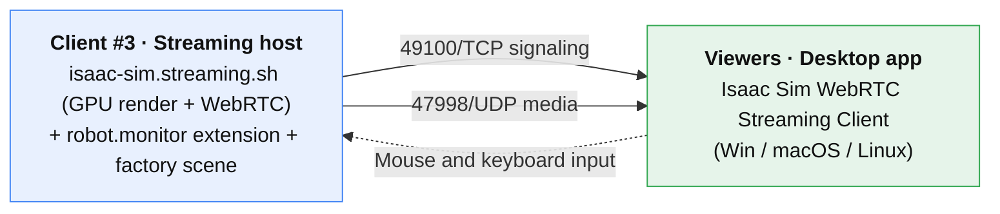

> 🇰🇷 [한국어](../04-스트리밍-뷰어.md) | 🇺🇸 English

# 04. Streaming Viewer — Watch and Control the Twin from a Laptop (Optional)

> **← Previous:** [03. Live Data](03-live-data.md) &nbsp;|&nbsp; **Back to start:** [Course Guide](../../README.en.md)
>
> **Goal**: Turn **one of the three deployed Isaac Sim clients into a "streaming host"**,
> and have the remaining viewers watch that twin in real time from a **desktop app on their own laptops**.
> The stream is primarily for spectating, but **mouse clicks, drags, and keyboard input are forwarded to the remote scene**, so you can operate it too
> (rotate the camera, click-select robots, work the panels, etc.). Only the one host needs a GPU.
> Just copy and paste the commands.
> **Time**: About 20–30 minutes (assuming the infrastructure is already up).



Prerequisites:
- **3 clients + 1 Nucleus server** already deployed via `cdk-omniverse` (README Quick Start).
- The CDK in this document is the version that already opens the **WebRTC ports (49100/TCP, 47998/UDP)** in the client security group.
  (If you deployed with an older version, re-apply the ports with **STEP 0** below.)
- Region example: `ap-northeast-2` (Seoul).

> ⚠️ **GPU caution**: WebRTC livestreaming requires the NVENC encoder. The workshop default `g6e` (L40S) supports it.
> A100-family instances do not support livestreaming — do not change the instance type.

---

## STEP 0. Open the WebRTC Ports (deploy/update)

They are already included in the client security group in `cdk-omniverse/lib/omniverse-workshop-stack.ts`.
If you have an older stack without the ports, redeploy to apply them:

```bash
cd ~/digital_twin/cdk-omniverse   # (adjust to your repo path)
npx cdk deploy \
  -c keyName=<key-pair-name> \
  -c isaacAmiId=<Isaac Sim AMI> \
  -c allowCidr=$(curl -s https://checkip.amazonaws.com)/32 \
  -c viewerCidr=15.0.0.0/8 \
  -c clientCount=3 \
  --parameters NgcApiKey=nvapi-xxxx \
  --parameters UbuntuPassword=<DCV password>
```

- **`allowCidr`**: IP allowed for management access (DCV, SSH) — the administrator's IP as a `/32`. (Required)
- **`viewerCidr`**: CIDR allowed for viewers (WebRTC connections) — the IP range viewers connect from.
  If unspecified, it falls back to `allowCidr` (for solo testing). `0.0.0.0/0` is forbidden.

Ports opened (client SG):
| Port | Protocol | Source | Purpose |
|------|----------|------|------|
| 8443 | TCP | `allowCidr` | DCV remote desktop |
| 22 | TCP | `allowCidr` | SSH |
| **49100** | **TCP** | `viewerCidr` | **WebRTC signaling** |
| **47998-48010** | **UDP** | `viewerCidr` | **WebRTC media — opening only TCP gives no video** |
| 8210 | TCP | `viewerCidr` | (Appendix) browser web viewer |

> ⚠️ **Open the media UDP as a range (47998-48010).** Isaac Sim 5.1 pins the media ports to this range
> via `minHostPort~maxHostPort` (STEP 2), which is what lets us keep the SG narrow.
> (Vanilla WebRTC allocates arbitrary dynamic UDP ports that a SG can't scope.)

After deployment, **`StreamHostPublicIp`** in the `Outputs` is the public IP of the client (#3) to use as the streaming host.
It is referred to as `HOST_IP` below.

---

## STEP 1. Connect to the Streaming Host (Client #3)

Connect to the client you'll use as the host via **DCV (`https://<HOST_IP>:8443`)** or SSH.
Streaming runs as a separate **headless (`--no-window`)** process, so here we launch it purely for streaming.

Find the host's own **public IP** (the address viewers will connect to):
```bash
HOST_IP=$(curl -s https://checkip.amazonaws.com); echo "HOST_IP=$HOST_IP"
```

---

## STEP 2. Run the Streaming Server (on the host)

On the marketplace AMI, Isaac Sim is installed at `/opt/IsaacSim`.
Launch with the extension attached so our factory twin (4 robot types + the `robot.monitor` panel) is streamed too:

```bash
cd /opt/IsaacSim
./isaac-sim.streaming.sh \
  --ext-folder /home/ubuntu/digital_twin/exts --enable robot.monitor \
  --/app/livestream/publicEndpointAddress=$HOST_IP \
  --/app/livestream/minHostPort=47998 \
  --/app/livestream/maxHostPort=48010
```
- The first startup takes several minutes for shader compilation (the very first can take over 10 minutes). Only connect after **both**
  **`Streaming server started.`** and **`Isaac Sim Full Streaming App is loaded.`** appear in the log (connecting before load gives a black screen).
- The `robot.monitor` extension **auto-opens `factory_scene.usda`** (about 3 seconds after startup).
  The "Robot Telemetry Monitor" panel comes up with it.
- **Leave this window (SSH/terminal) running.** Stop with Ctrl+C.

> ⚠️ **The settings keys are for Isaac Sim 5.1** (verified empirically). The official docs' form
> `--/exts/omni.kit.livestream.app/primaryStream/publicIp=...` is the **6.0 namespace and is ignored on 5.1**.
> 5.1 uses the `/app/livestream/` namespace:
> - `publicEndpointAddress=<public-IP>` — **required for NAT/public-network access**. Without it, the server advertises only its private IP (10.x),
>   viewers can't receive media, and you get a **black screen**.
> - `minHostPort`/`maxHostPort` — pin the media UDP ports to this range (matching the SG's 47998-48010).
> - The signaling port (49100) is the extension default, so no explicit setting is needed.

> **Why the UI panels appear in the stream**: the streaming app has `hideUi=false`, so it renders not just the viewport but also omni.ui windows.
> WebRTC encodes the entire GPU-rendered frame, so the "Robot Telemetry Monitor" panel appears
> in the viewer's screen as-is, and the checkboxes and combo boxes can be operated remotely.
> (Verified: extension load and auto scene open on an EC2 g6e (L40S) deployed client, plus remote connection
> and control from a laptop native client, all confirmed hands-on.)

> To get IoT live data flowing too, run `factory_simulator.py` from [03. Live Data](03-live-data.md) in a separate terminal.

---

## STEP 3. Install the Native Client on Viewer Laptops

Each viewer downloads the **Isaac Sim WebRTC Streaming Client** desktop app.
Get the package for your OS from the **"Latest Release"** section of the NVIDIA Isaac Sim download page.
(Docs: Isaac Sim → Download → *Isaac Sim WebRTC Streaming Client*)

- **Windows**: run the installer, then launch the app.
- **macOS**: open the `.dmg` and drag **Isaac Sim WebRTC Streaming Client** to **Applications**.
- **Linux (Ubuntu)**:
  ```bash
  sudo dpkg -i ./isaacsim-webrtc-streaming-client-*-linux-*.deb
  ```

> Client and server versions don't have to match exactly, but the workshop is based on **Isaac Sim 5.1**,
> so the latest (or a 5.x) client is a safe choice.

---

## STEP 4. Connect

1. Launch the **Isaac Sim WebRTC Streaming Client** app.
2. Enter the streaming host's address in the server IP field:
   ```
   <HOST_IP>          # e.g. 3.35.x.x   (for local testing, the default 127.0.0.1)
   ```
   > You don't enter a port in the app — it's handled by the server-side 49100/47998 settings.
3. Click **Connect**. The connection can take a few seconds.
4. Once the twin appears, you can **rotate the camera with the mouse, click robots**, and use keyboard shortcuts (e.g. **F7** to maximize the viewport).

Multiple people can connect to the same host **at the same time** (each with their own session).

---

## STEP 5. Things to Check

1. Host log shows `Streaming server started.` + `... Streaming App is loaded.`
2. The client shows the twin after **Connect**.
3. In the viewport, **dragging the mouse rotates the camera**, and clicking a robot switches the "Robot Telemetry Monitor" panel to that robot.
4. (With live data connected) all 4 robots move and the charts refresh every 5 seconds.

---

## STEP 6. Cleanup

- Host: **Ctrl+C** in the streaming terminal.
- Delete the entire infrastructure (to avoid charges): `npx cdk destroy` in `cdk-omniverse`.
- To close just the ports temporarily, remove the 49100/47998 ingress rules from the SG and redeploy.

---

## Common Sticking Points

| Symptom | Fix |
|------|------|
| Connected but **black screen** (most common) | ① Did you pass `publicEndpointAddress=$HOST_IP`? (Without it, the server advertises only the private IP → media fails.) ② Is media UDP 47998-48010 open to `viewerCidr`? ③ Did you connect only after `App is loaded` appeared? |
| `Connect` fails entirely | Confirm TCP **49100** is open and your IP is within `viewerCidr`. |
| Persistent black screen — check actual ports | On the host while connected: `sudo ss -aunp \| grep kit` → if the actual media UDP port is outside 47998-48010, re-check min/maxHostPort. |
| Video shows but **encoding errors/crashes** | Does the GPU support NVENC? (`g6e` OK, A100 ✗.) Check the instance type. |
| Scene is empty | Did you launch with `--ext-folder ... --enable robot.monitor` in STEP 2? |
| Scene doesn't auto-open | The extension looks for `/home/ubuntu/digital_twin/iot/factory_scene.usda`. Confirm the path exists. |
| Stuttering with many viewers | Host GPU/network bandwidth limit. Reduce the number of viewers or upgrade the host instance. |
| Windows firewall warning | Allow network access for the client app. |

---

## Appendix. Browser Web Viewer (no install, but requires Docker Compose)

There is also an install-free option: connect with a **Chromium browser** to `http://<HOST_IP>:8210`.
However, this web viewer only runs via **`tools/docker/docker-compose.yml` in the IsaacSim GitHub repo**
(the marketplace AMI native install has no web page — confirmed), so you must run the container separately on the host.

Overview (on the host, Ubuntu only):
```bash
git clone --depth 1 https://github.com/isaac-sim/IsaacSim.git && cd IsaacSim
docker login nvcr.io                                   # $oauthtoken / NGC API key
ISAACSIM_HOST=$HOST_IP ISAAC_SIM_IMAGE=nvcr.io/nvidia/isaac-sim:5.1.0 \
  docker compose -p isim -f tools/docker/docker-compose.yml up -d
docker compose -p isim -f tools/docker/docker-compose.yml logs web-viewer | grep -i http
```
Then open `http://<HOST_IP>:8210` in the browser. The SG needs **8210/TCP** added.

Caveats:
- To include the twin scene/extension, bind mount `/home/ubuntu/digital_twin` into the `isaac-sim` service and
  add `--ext-folder ... --enable robot.monitor` to the streaming launch arguments.
- The docs' example image is `isaac-sim:6.0.1`, but the workshop scene targets 5.1 → **pinning to 5.1.0** is recommended.
- Clipboard paste is blocked by the browser over HTTP (insecure) (a Chrome flag is required).
- **This browser path is unverified on real EC2** — if you need it, rehearse before the workshop.

The workshop default is the **native client** (STEP 1–4 above): no version-matching or container-prep burden.

---

For detailed infrastructure and ports see [`../../cdk-omniverse/README.en.md`](../../cdk-omniverse/README.en.md), for the twin scene and extension see [03. Live Data](03-live-data.md), and for the streaming field evidence see [`../../docs/en/streaming-field-notes.md`](../../docs/en/streaming-field-notes.md).

---

**Back to start →** [Course Guide (README)](../../README.en.md)
